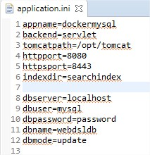

# 1. Install a JDK version >= JDK8

The WebDSL editor and compiler both need a JDK version >= 8 to function properly. Following these steps will make sure WebDSL functions properly, but feel free to experiment with your own setup.

## Linux and MacOS

* Use your package manager (e.g. `apt-get` on Ubuntu and `brew` on MacOS) to install OpenJDK. Alternatively you can also install OracleJDK with the installer from the Oracle website.

* Check that Java is installed correctly:

```bash
java -version
javac -version
```

## Windows

* Download the OpenJDK 8 zip file from [the OpenLogic website](https://www.openlogic.com/openjdk-downloads?field_java_parent_version_target_id=416&field_operating_system_target_id=436&field_architecture_target_id=391&field_java_package_target_id=396)
* Extract `openjdk-8u272-b10.zip` to a directory you like
* Set your `JAVA_HOME` directory by doing the following:
  * Open your Windows environment variable settings
  * Press "Environment Variables"
  * Press "New" under system variables
  * Set variable name to `JAVA_HOME` and variable value to `<Folder you extracted to>` (`C:\Program Files\OpenJDK\openjdk-8u272-b10` in our case)


  * Press "OK"

* To test if your `JAVA_HOME` path is set properly, open a new command prompt window and execute the following command.

```bash
echo %JAVA_HOME%
# if it is set properly, it will return a path to your Java home directory
```

Add `%JAVA_HOME%\bin` to your Path environment variable:
  * Open your Windows environment variable settings.
  * Press "Environment Variables"
  * Select the `Path` variable under "System" and press "Edit"
  * Press "New"
  * Type `%JAVA_HOME%\bin` and press enter
  * Press "OK"

* Check that the Java version is installed correctly: open a new command prompt window and execute the following command

```bash
java -version
# should return:
# openjdk version "1.8.0-272"
# OpenJDK Runtime Environment (build 1.8.0-272-b10)
# OpenJDK 64-Bit Server VM (build 25.71-b10, mixed mode)

javac -version
# should return:
# javac 1.8.0-272
```

# 2. Install Apache Ant

The WebDSL Compiler uses Apache Ant as a command-line tool to help build applications. If Ant is not installed on your system, follow these steps.

## Linux and MacOS

* Use your package manager (e.g. apt-get on Ubuntu and brew on MacOS) to install `ant`.
* Test by running the `ant` command:

```bash
ant
# should return:
# Buildfile: build.xml does not exist!
# Build failed
```

## Windows

* Download Apache Ant version 1.10.9 from [their download page](http://ant.apache.org/bindownload.cgi)
* Extract `apache-ant-1.10.9-bin.zip` in a folder you like
* Add the `ANT_HOME` as system environment variable:
  * Open your Windows environment variable settings.
  * Press "Environment Variables"
  * Press "New" under system variables
  * Set variable name to `ANT_HOME` and variable value to `<Folder you extracted ant to>`
  


  * Press "OK"
* Add the `%ANT_HOME%\bin` directory to your Path variable:
  * Select the `Path` variable under "System" and press "Edit"
  * Press "New"
  * Type `%ANT_HOME%\bin` and press enter
  * Press "OK"
* To test if your `Path` and `ANT_HOME` variables are set properly, open a new command prompt window and execute the following commands.

```bash
echo %ANT_HOME%
# if it is set properly, it will return a path to your Ant home directory

ant
# should return:
# Buildfile: build.xml does not exist!
# Build failed
```

# 3. Install the WebDSL compiler

Now that all the prerequisites are met, let's install the WebDSL compiler. The compiler is available as command-line tool and transforms your WebDSL applications to running websites.

* Download `webdsl.zip` from [https://update.webdsl.org/compiler/webdsl.zip](https://update.webdsl.org/compiler/webdsl.zip)


* Extract `webdsl.zip` in a folder you like

## Linux and MacOS

Add the `webdsl/bin` directory to your path environment variable.

* Confirm that the WebDSL compiler is installed correctly by opening a new command prompt window and executing the following command
```bash
webdsl version
# If the WebDSL compiler is installed successfully, the output ends with the following:
# ...
# command0: version
#
# Invoking WebDSL compiler
#
# webdsl arguments: --version
# Directory: <your pwd here>
# Java options: -Xmx2G -Xss12m
# Classpath: <your webdsl bin directory>\webdsl.jar, strategoxt.jar
# WebDSL version: 0b580cfb3a8623453bb2d54d1bcb06bf3c964977
# FINISHED TASKS: `version` at XXXX-XX-XX XX:XX:XX
#
# BUILD SUCCESSFUL
# Total time: 3 seconds
```

## Windows

* Add `<Folder you extracted to>\webdsl\bin` to your path variable:
  * Open your Windows environment variable settings
  * Press "Environment Variables"
  * Select the `Path` variable under "System" and press "Edit"
  * Press "New"
  * Type `<Folder you extracted to>\webdsl\bin` and press enter
  * Press "OK"

* Confirm that the WebDSL compiler is installed correctly by opening a new command prompt window and executing the following command
```bash
webdsl version
# If the WebDSL compiler is installed successfully, the output ends with the following:
# ...
# command0: version
#
# Invoking WebDSL compiler
#
# webdsl arguments: --version
# Directory: <your pwd here>
# Java options: -Xmx2G -Xss12m
# Classpath: <your webdsl bin directory>\webdsl.jar, strategoxt.jar
# WebDSL version: 0b580cfb3a8623453bb2d54d1bcb06bf3c964977
# FINISHED TASKS: `version` at XXXX-XX-XX XX:XX:XX
#
# BUILD SUCCESSFUL
# Total time: 3 seconds
```

# 4. Install the WebDSL editor

In addition to the WebDSL compiler, the WebDSL editor is an eclipse plugin that provides an IDE for WebDSL applications. If you wish to use your existing Eclipse instance, you can install the WebDSL plugin manually from update site `https://webdsl.org/update`. If you do not already have Eclipse installed, or prefer to use a new Eclipse instance as WebDSL editor, follow these instructions. 

* Download `eclipse-windows-x64.zip` from the [build server](https://buildfarm.metaborg.org/view/WebDSL/job/webdsl-eclipsegen/lastSuccessfulBuild/artifact/dist/eclipse/)  (note: there are separate versions for Linux and MacOS)


* Extract `eclipse-windows-x64.zip` in a folder you like
* Open `eclipse.exe` from `<Folder you extracted to>\Eclipse\eclipse.exe`
* Create a new workspace for Eclipse to store your projects and preferences
* Press "Launch" 


* Close the eclipse welcome page


# 5. Creating a WebDSL "Hello World" application

With the WebDSL compiler and editor both present, let's start making our first application. Following these steps will guide you through creating a simple Hello World application and makes sure your WebDSL setup is correct.

* Open the WebDSL editor
* Right click in the "Package Explorer" window on the left


* Select "New WebDSL Project"
* A huge project configuration page shows up


* Enter "Project Name" (for example: `HelloWorld`)


* Press "Finish"
* Open `application.ini` to view all the WebDSL settings for our Hello World application
* In the `application.ini` change `db=h2` to `db=h2mem` to tell WebDSL to use an in-memory database when we run our Hello World application
* Open `HelloWorld.app` to view our newly created Hello World application

# 6. Running the WebDSL "Hello World" application

The recommended way of compiling and deploying your WebDSL application is through the command line interface. The following instructions transform your WebDSL application to a deployed system.

* Open a new command prompt window
* Change directory to the root folder of your Hello World application (`D:\files\eclipse-workspace\HelloWorld` in our case)
* Execute the following command

```bash
webdsl run
# This should start a local web server and generate the following output:
# ...
# [ Main | info ] stage 1: parsing HelloWorld.app         [ 0.78s ]
# ...
# [ Main | info ] stage 11: writing files                 [ 0.04s ]
# ...
# Now compiling generated Java code
# ...
# Some file copying
# ...
# Some SQL DROP/CREATE table statements
# ...
# Some Tomcat commands
# ...
# [XX Feb XX:XX:XX HelloWorld] Tomcat web server started, your web application is available at http://localhost:8080/HelloWorld. Press ctrl+c to stop the web server.
```

* Open a browser and navigate to `http://localhost:8080/HelloWorld`. This should display `Hello World` in plain text.


* Press Ctrl+C in your running command prompt to stop your local web server. Note that in our tests on Windows this did not stop the Tomcat Java executable when terminating in cmd. Use before running `webdsl run` again: `taskkill /f /im java.exe` (note: it should not kill eclipse, but might kill other Java processes).

## Update application and redeploy

Make some changes to the application and run `webdsl run` again to check that the new code is being deployed. New application code:

```
application HelloWorld

entity Item {
  text : WikiText
}

page root {
  var newitem := Item{}
  form {
    input( newitem.text )
    submit action{ newitem.save(); }{ "Add text" }
  }
  div {
    output( (from Item).length )
  }
  for( i: Item ){
    div {
      output( i.text )
      submit action{ i.delete(); }{ "Remove" }
    }
  }
}
```

Note that the WikiText type supports Markdown in the output:


# 7. Recommended: Using MySQL database

The default configuration of a WebDSL application is to use an H2 database. However, when working on applications for an extended amount of time, we recommend using a MySQL database. The use of MySQL versions above 5.7 is not thoroughly tested, therefore we recommend using a version <= 5.7.

# 7.1 Setting up MySQL using Docker

* Download [Docker](https://www.docker.com/products/docker-desktop)
* Start Docker Desktop
* Make sure Docker is running by executing the following command

```bash
docker --version
# should return: Docker version xx.xx.x, build xxxxxxx
```

* Create and start a docker container with MySQL version 5.7 by executing the following command:

```bash
docker run --name webdsl_mysql -p 3306:3306 -e MYSQL_DATABASE=webdsldb -e MYSQL_USER=mysql -e MYSQL_PASSWORD=password -e MYSQL_ALLOW_EMPTY_PASSWORD=true -d mysql:5.7
# should return:
# Unable to find image 'mysql:5.7' locally
# 5.7: Pulling from library/mysql
# xxxxxxxxxxxx: Pull complete
# ...
# xxxxxxxxxxxx: Pull complete
# Digest: sha256:...
# Status: Downloaded newer image for mysql:5.7
# xxxxxxxxxxxxxxxxxxxxxxxxxxxxxxxxxxxxxxxxxxxxxxxxxxxxxxxxxxxx

docker ps
# should return:
# CONTAINER ID   IMAGE       COMMAND                  CREATED         STATUS         PORTS                    NAMES
# ...
# xxxxxxxxxxxx   mysql:5.7   "docker-entrypoint.s…"   x minutes ago   Up x minutes   0.0.0.0:3306->3306/tcp   webdsl_mysql
```

* Your MySQL Docker container is now running.
  - To stop the container, run `docker stop webdsl_mysql` and to start it again use `docker start webdsl_mysql`

# 7.2 Using MySQL in WebDSL applications

* Open your WebDSL application in the WebDSL editor
* Open `application.ini` in the root directory of the application


* Alter the following values:
  * Remove the `db=h2mem` line
  * Remove the `dbfile=...` line
  * Change `dbmode` from `create-drop` to `update`
  * Add the line `dbserver=localhost`
  * Add the line `dbuser=mysql`
  * Add the line `dbpassword=password`
  * Add the line `dbname=webdsldb`



* Open a command prompt window
* Execute the following commands

```bash
docker exec -it webdsl_mysql mysql -u mysql -p
# should give some basic information about your server and end with
# ...
# mysql>

mysql> show databases;
# +--------------------+
# | Database           |
# +--------------------+
# | information_schema |
# | webdsldb           |
# +--------------------+
# 4 rows in set (0.00 sec)
```

* Run your WebDSL application as described in section 6
* After visiting `localhost:8080/HelloWorld` at least once, your mysql database should be initialized with the application's tables

```bash
mysql> use webdsldb;
# Database changed

mysql> show tables;
# +------------------------------------------------------------+
# | Tables_in_webdsldb                                         |
# +------------------------------------------------------------+
# | _dummy_webdsl_entity                                       |
# | _queuedemail                                               |
# | _requestlogentry                                           |
# | _sessionmanager                                            |
# | _sessionmessage                                            |
# | _validationexception                                       |
# | _validationexceptionmultiple                               |
# | applicationcontextproperty                                 |
# | file                                                       |
# | sessionmanager_messages_sessionmessage                     |
# | validationexceptionmultiple_exceptions_validationexception |
# +------------------------------------------------------------+
# 11 rows in set (0.00 sec)

mysql> quit;
# Bye
```

* Your WebDSL Hello World application is now succesfully using your local MySQL server to store data

# 7.3 Optional: Installing MySQL locally

If you prefer installing MySQL locally instead of using a Docker container, follow these steps instead of section 7.1.

* Download the MySQL installer for 5.7.33 from [dev.mysql.com](https://dev.mysql.com/downloads/windows/installer/5.7.html)
* If existing MySQL applications are installed, choose to update or skip them until you reach the MySQL Installer window


* Press the "Add..." button on the right side
* Under Available Products, select MySQL Servers -> MySQL Servers -> MySQL Server 5.7 -> Top x64 item of the list
* Press the green arrow to add it to the install list
* Click "Next" and finish the installation procedure
* Find your MySQL installation directory. In our case this is `C:\Program Files\MySQL\MySQL Server 5.7`
* Add `<MySQL installation directory>\bin` to your path:
  * Open your Windows environment variable settings
  * Press "Environment Variables"
  * Select the `Path` variable under "System" and press "Edit"
  * Press "New"
  * Type `<MySQL installation directory>\bin` and press enter
  * Press "OK"

* Open a new command prompt with administrator rights (right click -> Run as Administrator)
* Execute the following commands.

```bash
mysqld --initialize-insecure
# this should run for a while and then return without console output

mysqld --install
# should return: Service successfully installed.
```

* Open Windows Services by pressing WinKey + R and typing `services.msc` and press enter
* Scroll down to the MySQL service


* Right-click the MySQL service
* Press "Start"
* Your MySQL database is now running
* Create your database by executing the following commands.

```bash
mysql -u root
# should give some basic information about your local server and end with
# ...
# mysql>

mysql> show databases;
# +--------------------+
# | Database           |
# +--------------------+
# | information_schema |
# | mysql              |
# | performance_schema |
# | sys                |
# +--------------------+
# 4 rows in set (0.00 sec)

mysql> create database webdsldb;
# Query OK, 1 row affected (0.00 sec)

mysql> show databases;
# +--------------------+
# | Database           |
# +--------------------+
# | information_schema |
# | mysql              |
# | performance_schema |
# | sys                |
# | webdsldb           |
# +--------------------+
# 5 rows in set (0.00 sec)
```

* Your WebDSL Hello World application is now using your local MySQL server to store data

## Local MySQL installation notes

To use the MySQL database for our WebDSL application, we changed the `dbuser` and `dbpassword` in the `application.ini` in 7.2 but these values were based on the Docker command from 7.1. When using a local mysql installation, you might have to adjust the `application.ini` to the correct values:
  * Change the line `dbuser=mysql` to `dbuser=root`
  * Change the line `dbpassword=password` to `dbpassword=` (empty)

# 8. Optional: Dark mode editor

Altough the editor color scheme is not configurable in the underlying system, we created a separate update site with dark mode friendly colors

* Go to eclipse `Help -> Install New Software...`
use the following update site url
https://webdsl.org/update-dark
* Additionally, to make the rest of eclipse dark go to eclipse `Help -> Eclipse Marketplace...`
  search and install `Darkest Dark Theme with DevStyle`

Screenshot:


# Troubleshooting

In this section, possible solutions to frequently reported issues are listed.

## Connections could not be acquired from the underlying database!


When the terminal where you executed `webdsl run` gives this error, WebDSL cannot reach the database specified in the `application.ini` in the root directory of your project.

* If your `application.ini` uses `db=h2`:
  - Stop your local webserver.
  - Change `db=h2` to `db=h2mem` and `dbmode=update` to `dbmode=create-drop` in your `application.ini`.
  - (For Windows users: execute `taskkill /f /im java.exe` in your command prompt)
  - Execute `webdsl run` again.
* If your `application.ini` uses a MySQL configuration:
  - Make sure all of the following values are set: `dbserver`, `dbuser`, `dbpassword`, `dbname` and there is no trailing whitespace.
  - In your terminal, make sure you can connect to your database using the following command: `docker exec -it webdsl_mysql mysql <dbname> -u <dbuser> -p` and enter the password value specified in your `application.ini`
  - 

## Port 3306 is already in use when attempting to run your docker container

* Remove the original docker container by executing `docker rm webdsl_mysql`. Make sure it is removed correctly by checking it is not in the list produced by `docker ps -a`
* Execute an altered version of the `docker run` command where the new MySQL port is 3307: `docker run --name webdsl_mysql -p 3307:3306 -e MYSQL_DATABASE=webdsldb -e MYSQL_USER=mysql -e MYSQL_PASSWORD=password -e MYSQL_ALLOW_EMPTY_PASSWORD=true -d mysql:5.7`
* When connection to your database using the terminal, specify the port (3307) as follows: `docker exec -it webdsl_mysql mysql <dbname> -h localhost -P 3307 -u <dbuser> -p` and enter the password value specified in `dbpassword` in your `application.ini`.
* change `dbserver=localhost` to `dbserver=localhost:3307` in your `application.ini`.
